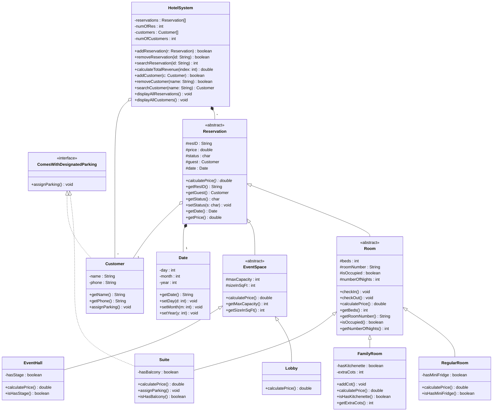

# 113CSC-HotelProject

```mermaid
classDiagram
    class ComesWithDesignatedParking {
        <<interface>>
        +assignParking() void
    }

    class HotelSystem {
        -reservations : Reservation[]
        -numOfRes : int
        -customers : Customer[]
        -numOfCustomers : int
        +addReservation(r: Reservation) boolean
        +removeReservation(id: String) boolean
        +searchReservation(id: String) int
        +calculateTotalRevenue(index: int) double
        +addCustomer(c: Customer) boolean
        +removeCustomer(name: String) boolean
        +searchCustomer(name: String) Customer
        +displayAllReservations() void
        +displayAllCustomers() void
    }

    class Date {
        -day : int
        -month : int
        -year : int
        +getDate() String
        +setDay(d: int) void
        +setMonth(m: int) void
        +setYear(y: int) void
    }

    class Customer {
        -name : String
        -phone : String
        +getName() String
        +getPhone() String
        +assignParking() void
    }

    class Reservation {
        <<abstract>>
        #resID : String
        #price : double
        #status : char
        #guest : Customer
        #date : Date
        +calculatePrice()* double
        +getResID() String
        +getGuest() Customer
        +getStatus() char
        +setStatus(s: char) void
        +getDate() Date
        +getPrice() double
    }

    class Room {
        <<abstract>>
        #beds : int
        #roomNumber : String
        #isOccupied : boolean
        #numberOfNights : int
        +checkIn() void
        +checkOut() void
        +calculatePrice() double
        +getBeds() int
        +getRoomNumber() String
        +isOccupied() boolean
        +getNumberOfNights() int
    }

    class EventSpace {
        <<abstract>>
        #maxCapacity : int
        #sizeInSqFt : int
        +calculatePrice() double
        +getMaxCapacity() int
        +getSizeInSqFt() int
    }

    class RegularRoom {
        -hasMiniFridge : boolean
        +calculatePrice() double
        +isHasMiniFridge() boolean
    }

    class FamilyRoom {
        -hasKitchenette : boolean
        -extraCots : int
        +addCot() void
        +calculatePrice() double
        +isHasKitchenette() boolean
        +getExtraCots() int
    }

    class Suite {
        -hasBalcony : boolean
        +calculatePrice() double
        +assignParking() void
        +isHasBalcony() boolean
    }

    class Lobby {
        +calculatePrice() double
    }

    class EventHall {
        -hasStage : boolean
        +calculatePrice() double
        +isHasStage() boolean
    }

    Reservation <|-- Room 
    Reservation <|-- EventSpace 
    Room <|-- RegularRoom 
    Room <|-- FamilyRoom 
    Room <|-- Suite 
    EventSpace <|-- Lobby 
    EventSpace <|-- EventHall 

    ComesWithDesignatedParking <|.. Suite 
    ComesWithDesignatedParking <|.. Customer 

    HotelSystem *-- "*" Reservation 
    Reservation *-- "1" Date 
    
    HotelSystem o-- "*" Customer 
    Reservation o-- "1" Customer

```
